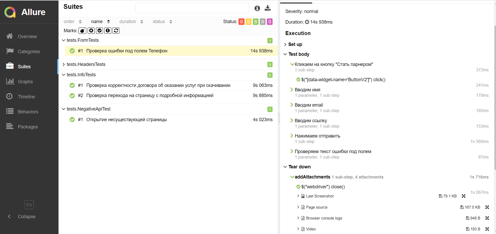
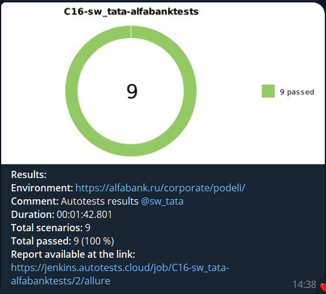

# Автотесты для страницы сервиса Подели, Альфабанк
[Ссылка на сервис здесь.](https://alfabank.ru/corporate/podeli/)

Тесты выбраны случайным образом исключительно для демонстрации навыков из тех, которые можно воспроизвести на проде, поэтому практическая польза их невелика.

## Технологии и инструменты 


## Что здесь есть:
* Настроена конфигурация для локального и удаленного запуска с помощью библиотеки [Owner](https://github.com/matteobaccan/owner)
* Параметризованная сборка, можно посмотреть в [Jenkins](https://jenkins.autotests.cloud/job/C16-sw_tata-alfabanktests/)
* Добавлены степы и листенер для понятного и наглядного Allure отчета с вложениями
* PageObject
* Параметризованные тесты
* Проверка информации в скачанном файле
* Нотификации в Телеграм с помощью специального бота после каждой сборки

## Удаленный запуск 

Необходим файл remote.properties cо следующим содержанием:

```browserSize = <browser window size>
browser = <browser type>
browserVersion = <browser version>
remoteUrl = <server url for remote run, I used Selenoid>
isRemote = true
```
и команда 
```gradle clean test -Denv=remote```

### [Allure report](https://jenkins.autotests.cloud/job/C16-sw_tata-alfabanktests/2/allure/)
В каждом тесте можно посмотреть скриншот, видео, логи консоли и page source.


### Телеграм бот:
Уведомляет ответственного, содержит краткий отчет о прохождении и ссылку на Allure отчет:


